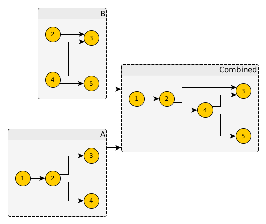

## cats support

`graphs` implements some typeclass instances to allow basic operations like combining graphs.

You need to add the `graphs-cats` dependency to use that:

@@@vars
```scala
libraryDependencies += "com.flowtick" %% "graphs-cats" % "$version$"
```
@@@

@@snip [SimpleGraphApp.scala](../examples/src/main/scala/CatsApp.scala)

Which computes the following combination of graphs:

